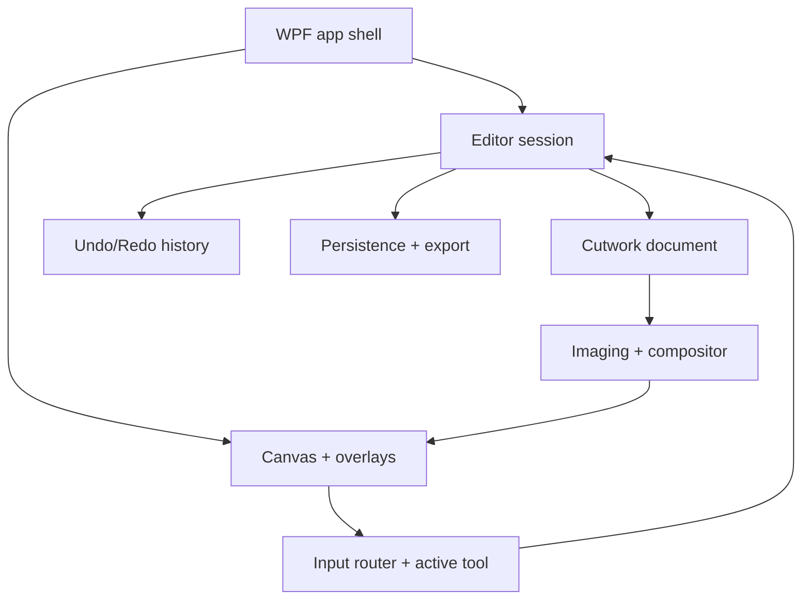
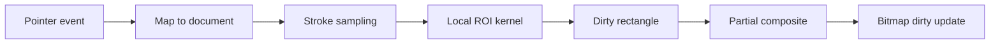

# Cutwork v0.1 production architecture

Status: proposed production authority for Issue [#3](https://github.com/flamoris-jp/flamoris-cutwork/issues/3)

This document defines the smallest production architecture that can preserve the useful behavior discovered by the Python experiments while becoming a responsive, conventional Windows application. Technology selection is recorded in [ADR 0001](decisions/0001-production-stack.md).

## 1. Product boundary

FLAMORIS Cutwork is a standalone Windows-oriented image decomposition and repair editor. It opens one ordinary illustration, lets a human isolate only the parts needed for a short moving-picture shot, repairs newly exposed holes when necessary, and exports the resulting layers.

The optimization target is:

> **perceptual sufficiency × editing speed**

Cutwork is separate from FLAMORIS 2D. It may export assets that 2D can consume, but it must not import or depend on 2D runtime internals.

### v0.1 non-goals

- pixel-perfect semantic segmentation;
- generative AI or cloud services;
- PSD compatibility;
- Live2D-class rigging or animation;
- a general-purpose paint application;
- cross-platform UI;
- a plugin framework;
- mandatory GPU rendering; and
- persisted edit-history playback.

## 2. Architectural principles

1. **The original is immutable.** Edits create masks, transformed derived content, and repair surfaces.
2. **Document space is authoritative.** Zoom, pan, DPI, and window size never change saved geometry.
3. **Tools express intent; imaging applies pixels.** UI event handlers do not own algorithms.
4. **One gesture is one undo unit.** Pointer frequency must not leak into user-visible history.
5. **Interactive and final rendering are distinct schedules, not distinct semantics.** Both use the same compositor and pixel rules.
6. **Dirty regions are first-class.** Every mutation reports the smallest conservative document rectangle it changes.
7. **GPU is an implementation detail.** Document, tool, persistence, and tests do not depend on a rendering backend.
8. **UI text is data.** Domain and controller logic emit codes/arguments; the shell localizes them.
9. **Experiments are behavioral evidence, not runtime dependencies.** Production code never imports Python experiment state or launchers.
10. **Do not abstract before a second implementation exists.** Interfaces protect real boundaries, not hypothetical frameworks.

## 3. System structure



### Responsibility boundaries

| Component | Owns | Must not own |
|---|---|---|
| App Shell | window, menus, commands, dialogs, toolbar, panels, locale choice, recent-file UI | pixels, masks, tool algorithms |
| Editor Session | current document, selection, active tool, dirty state, command execution, save coordination | WPF controls, localized prose |
| Document | stable IDs, dimensions, original asset, layer order, layer properties, authored surfaces/masks | viewport, pointer capture, dialogs |
| Tool Controller | tool state machines, modifier interpretation, gesture lifetime, overlays, edit requests | file I/O, direct WPF rendering, localized labels |
| Imaging | typed buffers, algorithms, compositing, dirty rectangles, decode/encode adapters | menus, layer selection, history policy |
| Canvas Renderer | viewport projection, cached composite presentation, overlay presentation, refresh scheduling | authoritative document geometry |
| History | undoable metadata/raster changes, transaction boundaries, memory budget | persistence format, UI-specific callbacks |
| Persistence | `.flimg` validation, migration, atomic save/open | active tool, viewport-only state, history |
| Export | PNG/layer package generation from a document snapshot | mutation of the live document |
| i18n | locale catalogs, fallback, formatting | domain decisions encoded in display strings |

The WPF application composes these concrete components directly. A dependency-injection container or mediator is not required for v0.1.

## 4. Windows application shell

### Layout

- Top menu: File / Edit / View / Layer / Export / Help.
- Left: compact vertical icon toolbar containing editing tools only.
- Center: canvas viewport.
- Right: Layers above contextual Properties.
- Bottom: optional lightweight status area for coordinates, zoom, progress, and localized tool guidance.

Document actions such as Open, Save, Export, Original Preview, Fit, and Actual Size belong in menus/commands. Frequently used commands may also have shortcuts, but are not duplicated as permanent prototype buttons without hands-on evidence.

### Shell state

The shell may retain application preferences outside `.flimg`:

- locale;
- window bounds and panel sizes;
- last-used import/export folders;
- recent files;
- default brush sizes; and
- optional theme.

Preferences are not document authority. Missing or corrupt preferences must fall back safely without preventing a project from opening.

### Command routing

WPF routed commands or a small command adapter connect menus and shortcuts to `EditorSession` operations. Availability (`CanExecute`) comes from session state. Keyboard mappings are defined in one input-command table, not repeated across controls and tools.

## 5. Document and layer model

### Document root

`CutworkDocument` contains:

- stable document UUID;
- canvas width and height in integer pixels;
- normalized color/pixel format metadata;
- one immutable `OriginalAsset`;
- one ordered layer stack with stable layer UUIDs;
- one required `BaseLayer`;
- document metadata and schema version; and
- a monotonically increasing in-memory revision used for cache invalidation.

The active layer, selection, pending polygon, clone source cursor, tool mode, viewport, and undo stack belong to `EditorSession`, not the document.

### Pixel convention

For v0.1:

- authoring color is normalized to 8-bit sRGB;
- in-memory composite/display surfaces use premultiplied BGRA8;
- persisted PNG assets use straight-alpha RGBA or grayscale as appropriate;
- integer pixel rectangles are half-open: `[left, top, right, bottom)`; and
- floating document coordinates refer to pixel centers consistently across tools.

The normalized immutable Original is persisted as a canonical lossless PNG and is the authoring authority after import. Exact encoded input bytes are also preserved when practical as provenance, but are not re-decoded to reconstruct an existing project. Wider-gamut, 16-bit, and full ICC workflows are deferred until an actual input/output requirement is accepted.

### Common layer fields

Every layer has:

- stable `id`;
- `kind` discriminator;
- editable display `name`;
- optional stable `semanticName` such as `eye_left`;
- `visible`;
- document-space transform where the kind allows it;
- optional attached 8-bit mask;
- stack position; and
- revision/cache metadata that is not serialized as authoring state.

`semanticName` is stored as an invariant identifier. Its label may be localized in the UI. Custom identifiers remain valid and are never translated in the file.

### Layer kinds

#### OriginalAsset

Not an editable stack layer. It preserves the canonical normalized surface and hash plus source filename/import provenance. Exact imported bytes may also be retained. Original Preview renders the canonical asset directly but does not alter layer visibility.

#### BaseLayer

Exactly one per document and fixed at the stack boundary between foreground Parts and underpaint Patch/Repair layers.

Base pixels are derived from the immutable original. Its alpha is the inverse of the union of all authored Part masks, independent of Part visibility. It stores visibility and identity, not a destructive copy of the original. A cached base surface may be generated for rendering but is not authority.

#### PartLayer

Represents pixels sampled from the immutable original through an authored mask. Required authored state is the mask plus common metadata. The initial transform is identity; Cutwork v0.1 does not become a rigging editor.

Part masks are stored as 8-bit grayscale to leave room for edge softness, while the first Part/Guriguri workflow may deliberately produce exact binary values. Manual mask editing changes the mask, never original RGB.

#### PatchLayer

Represents a user-chosen source fragment used as underpaint. On commit, the selected original pixels and local alpha are copied into a patch-local RGBA asset. The layer then owns:

- the patch-local RGBA surface;
- optional source polygon/original coordinates as provenance;
- position, scale, and rotation in document space; and
- an optional attached mask.

Freezing the patch-local source makes later transform and save/open deterministic even if implementation caches change. Scale is initially clamped to the hands-on range accepted by the product (currently up to 1000%).

#### Repair/PaintLayer

An RGBA underpaint surface populated by Clone and optionally adjusted by Blur/Smudge. It is separate from Original and Base. Clone always samples immutable Original pixels and writes the result into this derived surface.

For v0.1, the current raster surface is authoritative. Individual brush operations are retained only in the in-memory Undo/Redo history, avoiding an unbounded replay log during load or render.

### Stack constraints and composite order

The displayed stack is top-to-bottom. Default structure:

1. Part layers (foreground);
2. the unique Base layer;
3. Patch and Repair/Paint layers (underpaint).

Base is a fixed divider and cannot be deleted or moved out of its role. Reorder is allowed within the foreground and underpaint bands. Moving a layer across Base requires an explicit future use case; v0.1 rejects it rather than silently changing semantics.

Composite uses deterministic source-over order from bottom to top. Hidden layers do not contribute their pixels. The Base hole union is based on all authored Part masks regardless of visibility: hiding a Part hides its foreground pixels but does **not** close the authored Base hole, so repairs can be inspected without changing document geometry. This accepted v0.1 rule must be fixed by tests before implementation.

## 6. Coordinate spaces

Three spaces are explicit:

| Space | Purpose |
|---|---|
| Window/device space | WPF pointer positions and DPI-scaled control layout |
| Viewport space | canvas-control coordinates after DPI conversion |
| Document space | authoritative image pixels, masks, sources, transforms, and brush geometry |

`ViewportTransform` owns document-to-viewport and viewport-to-document affine matrices. Zoom and pan change only this object. All tools convert pointer samples to document space before creating or mutating authored state.

Brush radius is stored in document pixels. Its on-screen circular cursor is projected through the viewport transform, so the visible footprint matches the affected document region at every zoom level.

Viewport state is session/application state and is not required in `.flimg`. A later convenience field may be added as non-authoritative metadata without changing document geometry.

## 7. Tool and input architecture

### Input router

The canvas forwards normalized events to one `InputRouter`:

- pointer down/move/up/cancel;
- pointer capture lost;
- wheel delta;
- key down/up;
- current modifiers; and
- timestamp/device information.

The router owns global mappings such as Space/middle-button pan and `Ctrl+wheel` zoom. It then delegates remaining input to the active `ITool` state machine. WPF event handlers contain no editing algorithms.

### Tool contract

Each tool exposes the conceptual operations:

- activate/deactivate;
- begin/update/end/cancel gesture;
- handle wheel/key modifier changes;
- provide current cursor and overlay primitives; and
- provide contextual property descriptors.

Tools receive a constrained `ToolContext`: document queries, viewport conversion, selection, and an edit-transaction factory. They cannot open files, localize strings, or manipulate WPF controls.

Tool guidance is emitted as a stable message code plus formatting arguments, for example `tool.clone.source_required`, and localized by the shell.

### Shared stroke engine

Mask, Clone, Blur, and Smudge reuse one `StrokeSampler`:

1. accept document-space input points;
2. remove duplicate/noise samples;
3. interpolate between accepted points with spacing derived from brush radius and capped to avoid gaps;
4. divide work into small batches;
5. call the tool-specific ROI kernel; and
6. union returned dirty rectangles.

Pointer event density must not change the final coverage materially. Pressure may be carried by the event model but is not required for mouse-first v0.1 behavior.

### Production tool workflows

#### Part Tool

States: `Idle -> DrawingFence -> FittingPreview -> Committed`, with `Cancelled` returning to Idle.

Normal flow:

1. draw a rough 4–10 point polygon;
2. Enter/double-click closes it;
3. compute the deterministic outer-in Guriguri order from an immutable original snapshot;
4. wheel adjusts retained area with the hands-on direction chosen in Phase 3;
5. show the resulting mask overlay; and
6. commit one Part layer in one history transaction.

Exact polygon and manual mask correction are fallbacks inside the workflow, not separate permanent toolbar modes.

#### Mask Brush

One tool with a primary polarity. Normal drag uses the primary add/erase mode; holding Alt temporarily uses the inverse. Pointer-up creates one raster-mask history entry. The circular cursor always shows the effective radius.

#### Patch Tool

States: `ChoosingSource -> Placing -> Transforming -> Committed`.

The user selects a source polygon from Original, receives a new Patch layer, then positions/scales/rotates it as one understandable workflow. Escape cancels the uncommitted patch; committing produces one transaction even though several interaction phases occurred.

#### Clone Tool

- Alt+click sets a document-space source point in immutable Original.
- Releasing Alt returns to paint behavior without a mode switch.
- Pointer-down without a source reports `tool.clone.source_required`.
- At stroke start, preserve `offset = sourceAnchor - destinationAnchor`.
- Every destination sample reads `source = destination + offset` from Original.
- Wheel changes brush diameter; `Ctrl+wheel` always zooms.
- Hole Only, when enabled, uses a snapshot of the Part-mask union for the entire stroke.
- One stroke writes to the selected Repair/Paint layer and becomes one undo entry.

The prototype rectangle fence is not part of the production contract. A future optional fence can be added only if hands-on testing demonstrates a need.

#### Blur and Smudge

These are local ROI operations on an eligible derived raster target. They never mutate Original or silently rasterize Base/Part semantics. If the active layer is ineligible, the command remains disabled and the shell explains why through a localized message code.

#### Hand/Pan

Changes only `ViewportTransform`; it never creates history or dirties the document. Temporary Space/middle-button pan routes through the same controller.

## 8. Undo/Redo architecture

`HistoryService` maintains undo and redo stacks of `IEditCommand` objects. Cutwork borrows the useful intent of command/transaction architecture without reproducing FLAMORIS 2D's full system.

### Command categories

- value commands: rename, visibility, transform, semantic name;
- structural commands: create, delete, reorder layer;
- mask patch commands: before/after bytes for a changed mask rectangle;
- raster patch commands: before/after premultiplied/straight pixel bytes for a changed surface rectangle; and
- composite transactions: several commands committed as one user action.

### Gesture transaction

At pointer-down, a brush gesture opens a transient edit session and captures the original bytes only for rectangles it touches. Pointer moves update the live working surface for feedback. Pointer-up seals the unioned before/after ROI as one command. Escape or lost capture restores the before data. Redo stores/applies the after patch, so results do not depend on later pointer resampling.

Snapshots are ROI-based, not full-frame. History has a configurable memory budget and evicts the oldest complete transactions when needed. Saving does not serialize history; it marks the current document revision as the saved revision.

All document mutation goes through history-aware operations except initial load, deterministic cache rebuild, and explicit non-document session changes.

## 9. Rendering and interaction pipeline

### Separate surfaces

The canvas maintains:

- immutable decoded Original;
- authoritative masks and derived layer surfaces;
- per-layer render caches keyed by layer revision and requested document rectangle;
- one cached full-document composite surface;
- one `WriteableBitmap` presentation surface; and
- vector/lightweight overlay visuals for cursor, polygons, handles, and source markers.

The overlay layer is presented immediately and never forces image recomposition.

### Pointer-to-frame flow



### Interactive refresh

1. Pointer movement updates the cursor overlay immediately.
2. The active tool resamples the movement in document space.
3. Its kernel mutates only the target ROI and returns a conservative dirty rectangle.
4. The compositor recomputes only that rectangle across contributing visible layers.
5. Dirty rectangles are accumulated until the next scheduled presentation, rather than presenting once per pointer event.
6. The renderer copies/marks only the accumulated region in `WriteableBitmap`.
7. Pointer-up requests a full-quality refresh of the affected region and records the history command.

Pan and zoom normally change the WPF presentation transform and overlays without rebuilding document pixels. A quality refresh is allowed after interaction settles if interpolation mode or fit behavior requires it.

### Full-quality refresh

Full-quality and interactive refresh use identical layer order, masks, transforms, and alpha rules. Interactive mode may lower resampling quality or combine more dirty rectangles, but may not use different source pixels or omit completed mutations. Pointer-up, export, and save-preview generation use full-quality settings.

### Threading

Start with one serialized document-mutation lane and keep local brush kernels small enough to run within the interaction budget. Expensive read-only work such as Guriguri preprocessing, full decode, or export may run on background tasks over immutable snapshots and report cancellable progress.

Do not introduce concurrent writes to document surfaces in v0.1. If profiling shows local kernels exceed budget, move the same stroke processor to one dedicated worker queue; preserve input order and publish completed dirty regions back to the UI thread.

### Cache invalidation

Every layer and buffer has a revision. A change reports both the owning object and rectangle. The compositor invalidates:

- that layer's cache in the dirty rectangle;
- Base alpha when a Part mask changes;
- Base and final composite in the affected rectangle; and
- the final composite only when visibility/order changes require it.

Whole-document invalidation is reserved for open, canvas-size change, color-format change, or a structural operation whose bounds are genuinely global.

## 10. Performance boundary

Issue #2 remains the measurement authority for Clone Paint responsiveness. Production profiling records these stages separately:

1. pointer routing and document transform;
2. stroke interpolation;
3. Clone/Mask/Blur/Smudge kernel;
4. Hole Only mask lookup;
5. per-layer cache update;
6. partial composite;
7. `WriteableBitmap` copy/dirty update; and
8. WPF presentation cadence.

### Initial strategy

- cache the Part-mask union and freeze it for each Clone stroke;
- mutate only brush-local ROIs;
- avoid full-layer copies during pointer movement;
- keep cursor feedback independent from paint presentation;
- accumulate redraws to display cadence;
- perform one full-quality affected-region settle on pointer-up; and
- keep a benchmark mode out of normal UI, exposed through tests/developer diagnostics only.

### Escalation criteria

Do not add GPU or native-core complexity merely because a benchmark misses once. First identify the dominant stage. Escalate narrowly:

- optimize a managed/OpenCV kernel if kernel time dominates;
- reduce copies or change bitmap integration if transfer dominates;
- move only the renderer to Win2D/Direct2D if viewport/presentation dominates;
- introduce tiled/sparse buffers if memory or very-large-image invalidation dominates; or
- move a proven kernel behind a Rust/C++ ABI only if managed/native OpenCV options cannot meet the measured budget.

## 11. `.flimg` persistence

### Container goals

`.flimg` is a versioned ZIP container owned by Cutwork. It preserves editable project state; it is not a renamed PSD and does not promise compatibility with arbitrary ZIP image-layer conventions.

Proposed layout:

```text
project.flimg
  manifest.json
  assets/
    original.png            # canonical immutable authoring pixels
    source.bin              # optional exact imported bytes/provenance
    source-metadata.json
  layers/
    <layer-id>/mask.png
    <layer-id>/content.png
  preview/
    thumbnail.png          # optional, non-authoritative
```

`original.png` stores the normalized immutable authoring pixels and is the source used after reopening. Optional `source.bin` preserves the exact imported bytes for provenance. `source-metadata.json` records the original filename/extension/media type, checksums, decoded size, and normalization information. Only files needed by each layer kind are present.

### Manifest contract

The root manifest contains at minimum:

```json
{
  "format": "flamoris-cutwork",
  "schemaVersion": 2,
  "documentId": "uuid",
  "canvas": { "width": 3840, "height": 2160, "colorSpace": "srgb8" },
  "original": { "asset": "assets/original.png", "sha256": "...", "source": "assets/source.bin" },
  "layers": [
    { "id": "uuid", "kind": "part", "name": "left eye", "semanticName": "eye_left", "partOrder": 0, "visible": true, "mask": "layers/uuid/mask.png" },
    { "id": "uuid", "kind": "base", "name": "base", "visible": true },
    { "id": "uuid", "kind": "repair", "name": "repair", "ownerPartId": "uuid", "visible": true, "content": "layers/uuid/content.png" }
  ]
}
```

Transforms use document-space doubles and explicit units/degrees. JSON property names and enum values are invariant English identifiers. Localized display strings are never format tokens.

### Save/open behavior

- Save writes a new sibling temporary file, closes and validates it, then replaces the destination atomically where the filesystem permits.
- A failed save leaves the previous valid file intact.
- Open validates archive paths, entry sizes/count, manifest identity/version, dimensions, IDs, referenced assets, PNG dimensions, and canonical Original checksum before creating a live session.
- ZIP entries may not escape the archive root; duplicate authoritative paths are rejected.
- Unknown newer major schemas are rejected with a localized actionable error. Known older schemas pass through explicit deterministic migrations.
- Caches, active tool, selection, transient overlays, and Undo/Redo are not serialized.
- A loaded document must composite identically under the defined pixel rules. Byte-identical ZIP output is not a v0.1 requirement.

Autosave/recovery may later reuse the same writer, but is not required by this design phase.

## 12. Export boundary

Export operates on an immutable document snapshot and never edits the source project.

Initial outputs:

- a composite PNG for inspection;
- one transparent PNG per exported Part/Patch/Repair layer as applicable; and
- a deterministic JSON manifest containing order, stable IDs, semantic names, dimensions, and transforms.

Filename sanitization is presentation only; stable IDs and semantic names remain in JSON so collisions do not lose identity. Export should write to a new folder or archive transactionally enough that a failed export does not appear complete.

FLAMORIS 2D handoff can consume this neutral export later. It is not part of the `.flimg` runtime or a dependency from Cutwork to 2D.

## 13. i18n

### Locale policy

- default/neutral locale: Japanese (`ja-JP`);
- secondary locale: English (`en-US`);
- chosen locale is an application preference, not project state; and
- unsupported locale falls back to Japanese while diagnostic codes remain available for troubleshooting.

### Resource design

Use `.resx` catalogs and `ResourceManager` (or a thin typed wrapper) with stable keys such as:

- `menu.file.open`;
- `tool.clone.name`;
- `tool.clone.source_required`;
- `layer.kind.part`;
- `error.project.unsupported_version`; and
- `status.export.completed`.

Views bind to localized resources or localized view-model properties. Controllers, commands, validators, persistence, and algorithms return stable codes plus structured arguments. They never branch on translated text.

Use automatic/relative WPF layout, text wrapping, and Japanese-capable font fallback. Add a catalog-parity test that fails when Japanese or English keys are missing or placeholder sets differ.

Semantic presets use invariant IDs with localized labels, for example `eye_left -> 左目 / Left eye`. A custom semantic name is displayed as authored.

## 14. Python experiment migration

| Current reference | Production treatment | Reason |
|---|---|---|
| `polygon_guriguri.py` | Port algorithm and deterministic fixtures | Outside-in order, nested masks, and exact restoration are core behavior |
| `test_polygon_guriguri.py` | Port assertions/test vectors; keep Python test as oracle during migration | Strong deterministic contract |
| `clone_brush.py` | Rewrite around point-source production contract; reuse relative-offset, ROI, feather, Hole Only semantics | Rectangle fence is superseded; pixel behavior remains valuable |
| `test_clone_brush.py` | Port offset/Hole Only/interpolation assertions; replace rectangle-fence test with point-source bounds behavior | Tests must match accepted production interaction |
| `image_ops.py` | Port polygon mask, mask brush, alpha composite, patch affine, blur/smudge behavior selectively | Useful kernels, but current full-frame structure is not production architecture |
| `test_image_ops.py` | Port immutable-original, layer order, transform, mask, and coordinate tests | Captures important invariants |
| `model.py` | Preserve concepts; redesign types and constraints | Dataclasses mix experimental storage and session concerns |
| `layer_panel.py` | Preserve observed actions only; rewrite UI | Tk widgets and English hard-coded labels are not production authority |
| `app.py` | Preserve workflow and coordinate lessons; rewrite | Monolithic event/UI/cache orchestration must not migrate |
| `app_clone_guriguri.py` | Preserve profiling evidence and stroke semantics; rewrite | Current mode split and PhotoImage path are explicitly superseded |
| `GURIGURI.md` | Keep as experiment explanation; link to production behavior when implemented | Valuable rationale/history, not production architecture |

The original Python files should later move together to `experiments/python-tkinter/` in a dedicated reviewed repository-reorganization change. Do not mix that move with production behavior changes.

During each algorithm port:

1. create tiny deterministic fixture arrays with no private artwork;
2. record Python reference outputs where necessary;
3. implement the C# contract without WPF dependencies;
4. compare exact output for binary/identity rules and documented tolerance for filtered pixels; and
5. retain the Python reference until hands-on acceptance of the production tool.

## 15. Testing strategy

### Deterministic algorithm tests

- polygon fill and binary threshold behavior;
- Guriguri retained-count schedule, nested subsets, boundary resistance, and reverse restoration;
- stroke interpolation without gaps;
- clone relative offset, immutable source, image bounds, feather, and Hole Only;
- mask add/erase polarity;
- patch affine transforms up to accepted scale limits;
- blur/smudge local ROI containment; and
- premultiplied source-over composite results.

### Document/history tests

- unique Base invariant and stack bands;
- stable IDs, select/visibility/rename/reorder/delete rules;
- Base hole union behavior;
- original immutability;
- one gesture/one history entry;
- exact undo/redo for raster ROIs and metadata;
- cancel/lost-capture restoration; and
- saved-revision/dirty-state behavior.

### Persistence/export tests

- round-trip every layer kind;
- deterministic reconstructed composite;
- schema migration fixtures;
- corrupt/missing/duplicate/oversized/path-traversal entry rejection;
- atomic-save failure behavior where testable;
- export order, transforms, names, and filename collisions; and
- Japanese/English catalog parity.

### Interaction logic tests

Tool state machines use synthetic normalized input, without a WPF window:

- Part fence/fitting/commit/cancel;
- Alt temporary Mask polarity;
- Patch phase transitions;
- Clone Alt+click/source-offset/stroke lifecycle;
- wheel versus `Ctrl+wheel` routing;
- Space/middle-button pan; and
- ineligible-layer command state.

### Rendering acceptance

Use a very small set of synthetic golden composites and coordinate-alignment fixtures. Exact comparison is appropriate for binary masks and simple source-over cases; filtered/affine output uses an explicit tolerance and records the backend. Visual acceptance on representative real artwork covers seams, cursor footprint, Guriguri feel, zoom alignment, and perceived latency.

### Windows packaging

Packaging acceptance is initially a manual/smoke checklist on a clean Windows environment:

- launch without a development SDK;
- open PNG/JPEG;
- edit and save `.flimg`;
- reopen and export;
- Japanese default and English switch;
- file association when that feature is introduced; and
- no network dependency for core editing.

CI remains minimal: build plus deterministic unit tests on the supported Windows runner once production code exists. Add packaging CI only after the package is a stable release boundary. Do not run legacy Python and production C# suites redundantly after a migrated behavior is formally retired.

## 16. Proposed repository layout

No files are moved as part of Issue #3. The production implementation should adopt the following layout through a dedicated reviewed change:

```text
src/
  Cutwork.App/             WPF shell, canvas control, view models, resources
  Cutwork.Core/            document, editor session, tools, history, geometry
  Cutwork.Imaging/         buffers, algorithms, compositor, OpenCV adapter
  Cutwork.Persistence/     flimg reader/writer/migrations and export
tests/
  Cutwork.Core.Tests/
  Cutwork.Imaging.Tests/
  Cutwork.Persistence.Tests/
experiments/
  python-tkinter/          current Python prototypes and their reference tests
docs/
  production-architecture.md
  roadmap.md
  decisions/
```

Dependency direction:

- `Cutwork.Core` has no WPF/OpenCV/persistence dependency.
- `Cutwork.Imaging` depends on core value types/contracts, not the app.
- `Cutwork.Persistence` depends on document/imaging serialization contracts, not WPF.
- `Cutwork.App` composes all production projects.
- `experiments/` is never referenced by a production project.

If four projects prove noisy during scaffolding, Persistence may begin as a directory in Core with the same dependency rule and split when format migrations arrive. Do not collapse Imaging into the WPF project.

## 17. Remaining design questions

These should be resolved by the roadmap phase that first needs them:

1. Minimum supported Windows version and whether the first distributable is portable/self-contained only or also MSIX.
2. Final Guriguri wheel direction after a short hands-on comparison; Issue #1 says the current experimental direction feels reversed.
3. Whether v0.1 limits import/export to 8-bit sRGB PNG/JPEG or needs another format immediately.
4. Exact default brush diameter/feather and the memory budget for Undo/Redo.
5. Whether `.flimg` becomes the final public extension or remains provisional until the first persistence round trip.
6. Whether Patch/Repair need controlled cross-Base movement; v0.1 defaults to fixed stack bands.

None of these questions blocks the foundation or first real-image canvas. They must not be answered by scattered implementation defaults.
